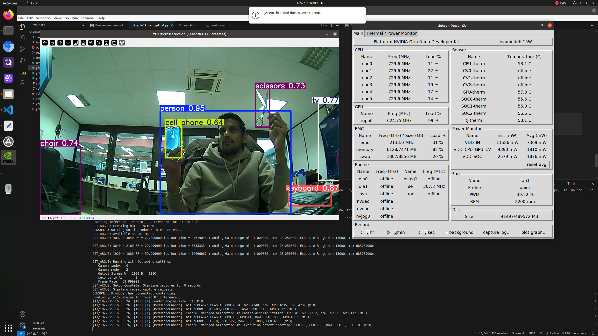

# YOLOv12 Detection on Jetson Orin Nano (MIPI CSI Camera)

This project runs **Ultralytics YOLOv12** on a **Jetson Orin Nano Developer Kit** using a **MIPI CSI camera (imx477)** with a **pure GStreamer pipeline** (no OpenCV GStreamer support required).



---

## 1. Jetson Environment

Device & OS:

```bash
head -n 1 /proc/device-tree/model
# NVIDIA Orin Nano Developer Kit

cat /etc/nv_tegra_release
# R35 (release), REVISION: 4.1, ...   # → JetPack 5.1.2 / L4T 35.4.1

lsb_release -a
# Distributor ID: Ubuntu
# Description:    Ubuntu 20.04.6 LTS
# Codename:       focal

nvcc --version
# Cuda compilation tools, release 11.4, V11.4.315
````

Python:

```bash
python3 --version
# Python 3.8.10
```

OpenCV (from Ubuntu repo, without GStreamer):

```bash
sudo apt install -y python3-opencv
# Version: 4.2.0+dfsg-5 on Ubuntu 20.04
```


## 2. Check MIPI CSI Camera

List video devices:

```bash
ls /dev/video*
# /dev/video0
```

Check camera with `v4l2-ctl`:

```bash
sudo apt install -y v4l-utils

v4l2-ctl --list-devices
# NVIDIA Tegra Video Input Device (platform:tegra-camrtc-ca):
#     /dev/media0
#
# vi-output, imx477 9-001a (platform:tegra-capture-vi:1):
#     /dev/video0
```

Test camera with GStreamer:

```bash
gst-launch-1.0 nvarguscamerasrc sensor-id=0 ! 'video/x-raw(memory:NVMM),width=1280,height=720,framerate=30/1' ! nvvidconv ! 'video/x-raw,format=I420' ! xvimagesink -e
```

If you see live video, the MIPI CSI camera + Argus stack are OK ✅


## 3. Create Project & Python Virtual Environment

Create project folder:

```bash
cd ~
mkdir -p yolov12_cam
cd yolov12_cam
```

Install venv support (only once):

```bash
sudo apt update
sudo apt install -y python3.8-venv
```

Create a venv that can reuse system OpenCV:

```bash
python3 -m venv .venv --system-site-packages
source .venv/bin/activate
```

Upgrade pip inside the venv:

```bash
python3 -m pip install --upgrade pip
```


## 4. Install Dependencies (NumPy, PyTorch, Torchvision, Ultralytics)

Install BLAS dependency:

```bash
sudo apt install -y libopenblas-dev
```

Install a compatible NumPy version:

```bash
python3 -m pip install "numpy==1.24.4"
```

Install **Jetson-specific PyTorch wheel** for JetPack 5.1.x (Python 3.8):

```bash
export TORCH_INSTALL=https://developer.download.nvidia.com/compute/redist/jp/v511/pytorch/torch-2.0.0+nv23.05-cp38-cp38-linux_aarch64.whl

python3 -m pip install --no-cache-dir "$TORCH_INSTALL"
```

Install torchvision + Ultralytics:

```bash
pip install "torchvision==0.15.1"
pip install ultralytics
```

Quick check:

```bash
python3 - << 'EOF'
import torch
print("Torch version:", torch.__version__)
print("CUDA available:", torch.cuda.is_available())
EOF
```

You should see `CUDA available: True`.


## 5. Install GStreamer Python Bindings

Since OpenCV was built **without GStreamer support**, we use **GStreamer directly** via Python GI:

```bash
sudo apt install -y python3-gi gir1.2-gstreamer-1.0 gir1.2-gst-plugins-base-1.0 gstreamer1.0-tools gstreamer1.0-plugins-good gstreamer1.0-plugins-bad
```


## 6. YOLOv12 + GStreamer Python Script (PyTorch)

The main Python script for PyTorch inference is:

- `yolo12_cam_gst.py`

It:

- Opens the MIPI CSI camera using a GStreamer pipeline.
- Converts frames to NumPy.
- Runs YOLOv12 (`yolo12n.pt`) on the GPU.
- Displays annotated detections with OpenCV.

If you want to customize things (resolution, FPS, which classes to detect, etc.), edit this file directly:

- GStreamer pipeline: inside `create_pipeline()`
- YOLO classes: the `classes=` argument in the `model(...)` call  
  - `classes=[0]` → person only  
  - `classes=[43, 34]` → knife + baseball bat  
  - `classes=None` → all classes (default)

## 7. Run YOLOv12 Detection

Each time you reboot or open a new terminal:

```bash
cd ~/yolov12_cam
source .venv/bin/activate
python3 yolo12_cam_gst.py
```

* First run will download `yolo12n.pt`.
* A window opens and shows live camera feed.
* **Only persons** are detected (COCO class [0] or ["person"]).
* Press `q` or `Esc` to quit.

## 8. (Optional) Export YOLOv12 to TensorRT for Higher FPS

### 8.1. Install ONNX tools

In the venv:

```bash
cd ~/yolov12_cam
source .venv/bin/activate
sudo apt install -y protobuf-compiler libprotoc-dev cmake

pip install "onnx==1.14.0" "onnxslim>=0.1.71"

# or 
pip install "onnx==1.14.0"

```

> Note: Ultralytics may warn about `onnxruntime-gpu`. It is not required for TensorRT export on Jetson.

### 8.2. Export script: `yolo12_export_trt.py`

Run the export:

```bash
cd ~/yolov12_cam
source .venv/bin/activate
python3 yolo12_export_trt.py
````

You should get:

* `yolo12n.onnx`
* `yolo12n.engine` (TensorRT engine, ~7–8 MB)

## 9. YOLOv12 + GStreamer TensorRT Script

The main Python script for **TensorRT inference** is:

* `yolo12_cam_gst_trt.py`

It:

* Uses the same GStreamer pipeline as the PyTorch script.
* Loads the TensorRT engine file (e.g. `yolo12n.engine`).
* Includes a small `np.bool` compatibility fix for older TensorRT Python bindings on Jetson.
* Runs YOLOv12 via TensorRT for higher FPS.
* Displays annotated detections with OpenCV.

Things you may want to customize in this file:

* **Engine path**:
  Make sure it matches the engine you exported, for example:

  ```python
  model = YOLO("yolo12n.engine")
  ```

* **Classes to detect** (in the `results = model(...)` call):

  * `classes=[0]` → person only
  * `classes=[43, 34]` → knife + baseball bat
  * `classes=[0, 43, 34]` → person + knife + bat
  * `classes=None` → all classes

## 10. Run YOLOv12 Detection (TensorRT)

After you’ve exported the engine (`yolo12n.engine`):

```bash
cd ~/yolov12_cam
source .venv/bin/activate
python3 yolo12_cam_gst_trt.py
```

---

### Why export YOLOv12 to TensorRT for higher FPS?

For **live video** (MIPI camera, streaming, robotics), the model must run fast enough to keep up with the incoming frames.  
Running YOLOv12 directly in PyTorch is simple and flexible, but it’s not fully optimized for Jetson.  
By converting the model to **TensorRT**, NVIDIA’s inference engine, you:

- Reduce latency (faster per-frame inference)
- Increase FPS (more real-time detections)
- Use GPU/Jetson hardware more efficiently (FP16, kernel fusion, etc.)

On a Jetson Orin Nano, this often makes the difference between a “laggy” 5–10 FPS demo and a **smooth real-time stream** that can be used on a robot or drone.

#### PyTorch vs TensorRT (on Jetson)

- **PyTorch (`yolo12n.pt`)**
  - ✅ Easiest to debug and modify
  - ✅ Same behavior as training environment
  - ❌ Slower inference, more overhead
  - ❌ Not fully optimized for Jetson hardware

- **TensorRT (`yolo12n.engine`)**
  - ✅ Much higher FPS for the same model
  - ✅ Lower latency → better for control loops / streaming
  - ✅ Uses FP16 and Jetson-specific optimizations
  - ❌ Needs an extra export step (ONNX → TensorRT)
  - ❌ Engine is specific to a given JetPack / GPU / input size

For development and debugging, you can stay in **PyTorch**.  
For **production or real robot/drone demos**, you should run the **TensorRT engine**.

### Important notes about the TensorRT engine

The `yolo12n.engine` file you export is **not generic** – it is optimized for the environment where you built it.

For example, an engine exported on:

- **Device:** Jetson Orin Nano  
- **JetPack / L4T:** 5.1.2 (L4T 35.4.1)  
- **Input size:** `imgsz=640`  

means:

- It may **not work** (or may be suboptimal) on a **different Jetson or JetPack version**.  
  → If you change board or update JetPack, you should re-export the engine on that device.

- It will **not support a different input size** (e.g. 1280×720) unless you exported with dynamic shapes.  
  → If you want a different resolution, you usually need to export again with the new settings.

In short:  
If you change **device**, **JetPack version**, or **model input size**, you should **re-run the export** to generate a new `.engine` file.

## 11. Quick launch script

To start the TensorRT YOLOv12 camera pipeline with a single command:

```bash
cd ~/yolov12_cam
chmod +x launch.sh
./launch.sh
```
